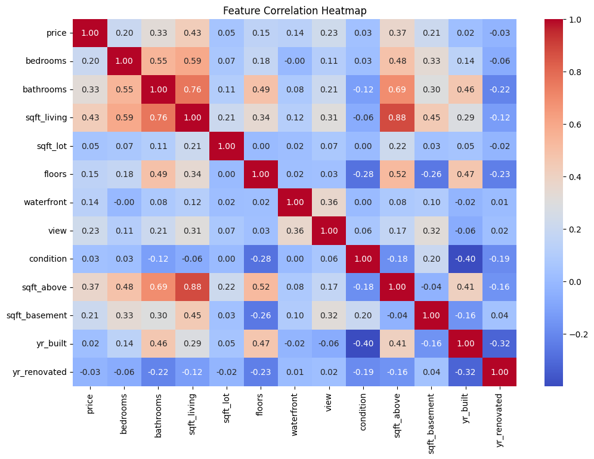
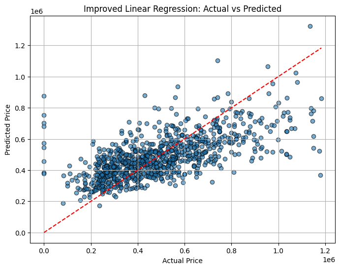

# 🏡 House Price Prediction | Linear, Ridge & Lasso Regression | R²: 0.45

This machine learning project focuses on predicting house prices based on multiple numerical features using various regression algorithms. The model is trained, evaluated, and visualized using Python and Scikit-learn.

---

## 📊 Dataset
- **Source**: Cleaned housing dataset (CSV)
- **Target Variable**: `price`
- **Features Used**:
  - sqft_living, bedrooms, bathrooms, floors, waterfront, view, condition, grade, sqft_above, sqft_basement, yr_built, yr_renovated
- **Engineered Features**:
  - `house_age` = 2024 - yr_built
  - `total_sqft` = sqft_living + sqft_basement

---

## 🔧 Technologies Used
- Python 3
- Pandas
- NumPy
- Scikit-learn
- Matplotlib
- Seaborn

---

## 🧹 Data Preprocessing
- Handled missing values
- Feature engineering (`house_age`, `total_sqft`)
- Outlier detection and removal (optional)
- Feature selection using correlation analysis

---

## 🤖 Models Implemented
- ✅ Linear Regression
- ✅ Ridge Regression
- ✅ Lasso Regression
- Compared via R² score and RMSE

---

## 📈 Evaluation Metrics

| Model             | R² Score | RMSE (₹)     |
|------------------|----------|--------------|
| Linear Regression| 0.4563   | 2,14,345      |
| Ridge Regression | --       | --            |
| Lasso Regression | --       | --            |

---

## 📸 Visual Outputs

### 📊 Correlation Heatmap
Visualizes correlation between each feature and the target price.




### 📈 Predicted vs Actual Prices
Regression scatter plot showing model fit.




---

## 📚 Key Learnings
- Applied linear and regularized regression techniques (Ridge, Lasso)
- Feature engineering significantly improves prediction
- Used correlation heatmaps to select relevant features
- Evaluated models using R² and RMSE

---

## 🚧 Need for Improvement

While the current model achieves a baseline performance with a **R² score of 0.4563** and **RMSE of ₹2.14L**, there are several areas where this project can be improved:

- 🔁 **Model Performance**: The R² score indicates underfitting. More robust algorithms like **Random Forest**, **XGBoost**, or **Gradient Boosting** can be introduced for better predictions.
- 🧠 **Advanced Feature Engineering**: Adding interaction terms, polynomial features, or domain-specific derived metrics may help improve model learning.
- 📉 **Outlier Detection**: Removing extreme price values or applying transformation (like log-scaling) could improve linear model behavior.
- ⚙️ **Hyperparameter Tuning**: Ridge and Lasso models can be tuned further using GridSearchCV or cross-validation.
- 📊 **Cross-Validation**: Currently, the model is evaluated on a single train-test split. Including k-fold cross-validation will ensure better generalization.

> ✅ These enhancements would help push the model beyond baseline and make it more suitable for real-world deployment.

## 📂 File Structure
```
├── House_Price_Prediction.ipynb        # Main notebook
├── housing.csv                         # Dataset
├── images/
│   ├── corr_heatmap.png
│   └── Linear_Regression.png
├── README.md
```

---

## ⚙️ How to Run
1. Clone this repository:
```bash
git clone https://github.com/shivamjha-9/house-price-prediction.git
```

2. Open the notebook in Google Colab or Jupyter Notebook.

3. Run all cells to train models and evaluate predictions.

---

## 🔗 Project Link
[👉 View on GitHub](https://github.com/shivamjha-9/house-price-prediction)

---

## 👤 Author

**Shivam Kumar Jha**  
🎓 B.Tech CSE | GEC Samastipur (Batch of 2027)  
🔗 [LinkedIn](https://www.linkedin.com/in/shivam-jha-a80825291)  
🐙 [GitHub](https://github.com/shivamjha-9)

---

## 📌 Status
✅ Project Completed — Final R² Score: 0.4563

---

## 📝 License
This project is open-source and available under the [MIT License](LICENSE).
